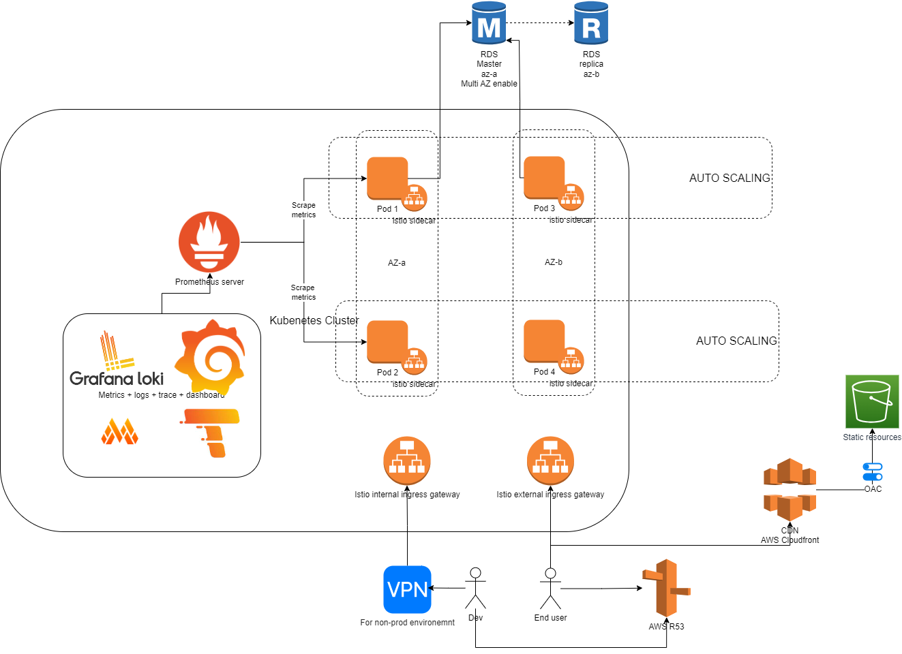

# High Level Architecture

## Backend
For backend cluster management, I choose EKS as AWS managed service that run K8s or just self-host
k8s with EC2 instance depends on which drawback we want.

### Operational
With K8s, we could let it handle auto scaling for deployment with HPA. For nodes we could use AWS autoscaler or Karpenter 
- About security and network mapping, I decide to choose [istio](https://istio.io/)