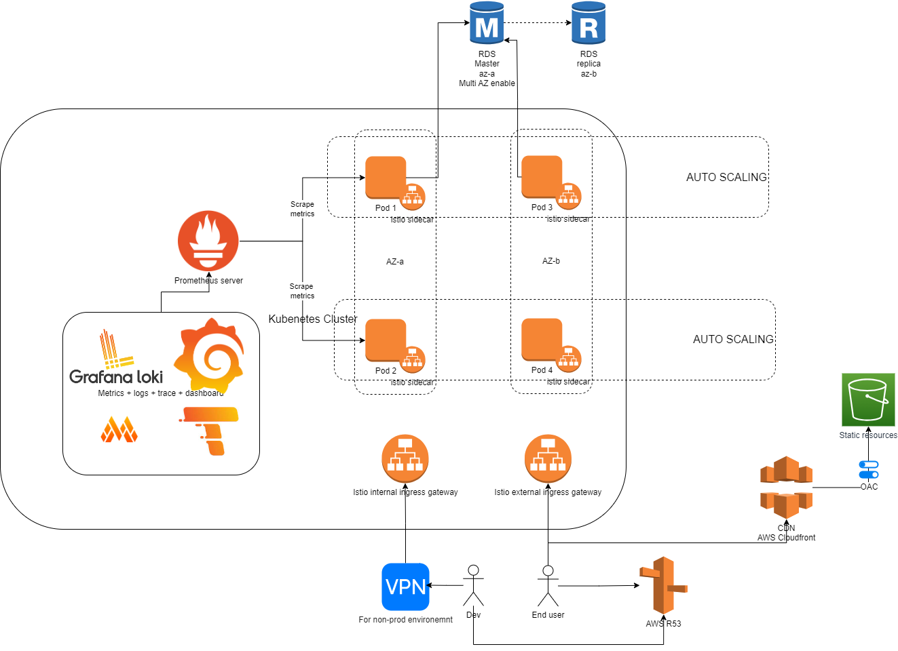

# Problem 1 - Design

## Backend
For backend cluster management, I choose EKS as AWS managed service that run K8s or just self-host
k8s with EC2 instance depends on which drawback we want.

### Component selection
1. Applications definition: Helm
2. Operation cluster: K8s/AWS EKS
3. Networking and network security control: Istio
4. Loging: Loki
5. Metrics + Alerts: Mimir
6. Tracing: Temppo
7. Visualization: Grafana

### Operational
With K8s, we could let it handle auto scaling for deployment with HPA. We could scale app up/down with CPU or Memory usage criteria.

For nodes we could use AWS autoscaler or Karpenter.
K8s is a good option for deployment operation which could manage, monitor status, failover mechanism definition. With HPA we could 
ensure availability of deployments. HPA provides multiple mechanism to scale up/down depends on metrics collected from pod.
Base on metrics and scaling to serve and keep deployments alive even through disasters.

For high level of deployment, we have nodes which contain pods. AWS Autoscaler or Karpenter is some candidate for maintain
status of nodes. Each node have limitation about resources and number of pods. Even pods could scale up during high load so we
also need to scaling nodes.

### Networking
Istio is the one apply for networking management, each deployment will be attached with a istio sidecar which have 
itself network metadata identify its definition in network mesh for the others could lookup and route traffic.

All routing will be defined and stored in the istio internal/external ingress gateway which are our load balancers for 
external and internal network.

- Internal network: For our developers directly access our component through VPN with security control. Each development environment will
have explicit policies for access permissions like Staging will have more permission than pre-production, etc.
- External network: For end user to connect, this load balancer will accept all connections from the out world, we might install it
behind and WAF (Web Application Firewall) to protect our applications from the internet. 

Im suppose to deploy our cluster which support multi A-Z region for high available ability. Every deployments will
have number of replica higher than 1 and split among AZ (For services need HA ability). 

More services replicas also help decrease workload on that services or we could say, increase throughput of services. Mesh network will
lower latency for microservices communication. Each service will directly talk to each other than go through a network manager.

### Logging + Alerts + Metrics + Tracing
We could use LGTM stack which is potential open-source for monitoring stack. All deployments will exports their metrics 
with prometheus exporter and be collected periodly with Prometheus scrapers.

Those metrics data will be:
- Visualize with Grafana's dashboard. With open source we have plenty free dashboard or customize dashboard from out world
- Logging query with Loki, 
- Detect application errors with Tempo tracing tool
- Mimir for alerts which automate detect abnormal behavior of applications for fast interception to avoid incident may occur

## Frontend
### Component Selection
- AWS Cloudfront
### AWS Cloudfront
For static files built up from CI/CD, we also need to make sure our CDN reliable and delivery them to end users.
We could lookup to AWS Cloudfront distribution. Or we could built up our CDN by our own. But it could be costly from
human resource for invent the wheel again. Except we have explicit reason for that, another needs.

AWS Cloudfront have ability to ensure:
- Operational + Reliability: multiple distribution manage by AWS with compliance
- Security: OAC (Origin access control) and [AWS compliance programs](https://aws.amazon.com/compliance/programs/)
- Performance efficiency: Amazon CloudFront has a global network of edge locations and intelligent software to deliver 
content to users across the world from the location that is closest to them or has the best performance

## Database
### Component Selection
- AWS RDS
### AWS RDS
- Depends on usage of deployments need database, we decide how many AWS RDS instances, each instances will have a number of
replicas for handle load from applications
- Each instance will enable multi AZ feature for high availability. But not all case need this feature, all depends on application requirements
- Connection from applications to RDS instance will be secure by AWS VPC security groups also with devops team to RDS instance.
Developers will not have permission to access RDS instances, this permission need to acquired from request devops team.
- 
