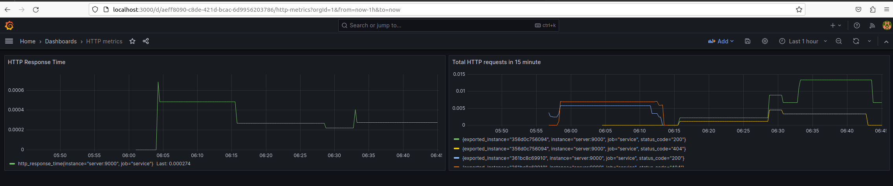

# Prerequisite
- docker
- docker-compose
# How to start
`docker-compose up --build`

## Grafana
- endpoint: `localhost:3000`
- username/password: `admin/admin`

We have 2 dashboards visualize total count of requests to service and response
time service finish handle request by time.

## Prometheus
- endpoint: `localhost:9090`
## Service
- trigger 200 status code request: `http://localhost:8080/`
- trigger 404 status code request: `http://localhost:8080/abc` or any endpoint except root `/`

